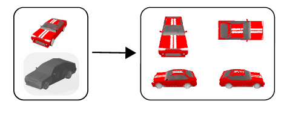
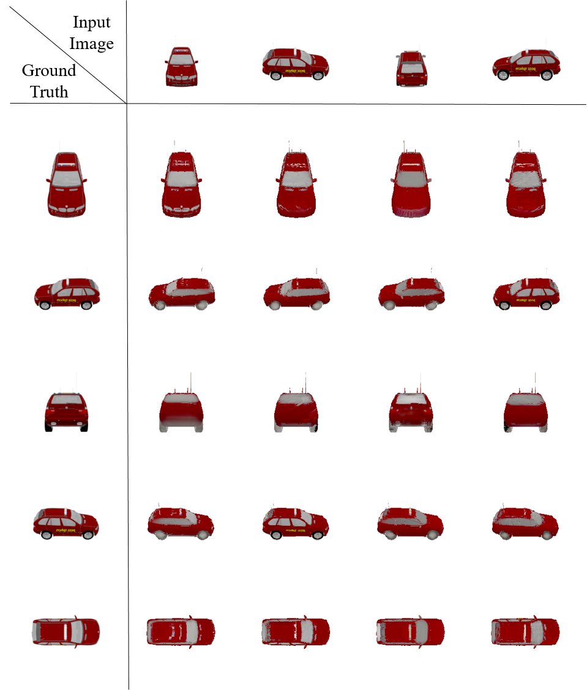

## Local and Global Texture Fields: 3D Texture Reconstruction



In this repository, we present 'Local and Global Texture Fields', a texture representation to render images from a 3D model and a condition image. Unlike the former Texture Fields representation, we extract local information from the condition image to improve the rendering quality.

Local and Global Texture Fields: Using a 3D model and a corresponding condition image, our method learns a mapping to represent the texture of the object and renders novel views. You may find [our project paper here](project_report.pdf).


### Dependencies
The code is implemented in Python (version 3.6.7) using [PyTorch](https://pytorch.org/) (version 1.0.0).
You are highly recommended to use [anaconda](https://www.anaconda.com/) to install all dependencies.
We provide the file `envorironment.yml` which lists all packages that are needed. The easiest way to install them is to create an environment called `texture_fields_env` with:
```
conda env create -f environment.yml
```

Activate the environment with the following command:
```
conda activate texture_fields_env
```
Change the name and prefix variables in the `environment.yml` file to your preferences.

###  Content
In this section, the content of the files and folders in the repository are described:

- `configs:` The folder of configuration files to modify the settings of the model.
- `create_dataset:` The folder contains the scripts that are used to create our new dataset.
- `evaluation:` This folder contains scripts that are used in arranging results, plots and baseline Texture Fields results.
-`examples:` The folder contains several visual results that we have obtained with our method. The examples contain an input condition image, fake images that are generated by our model and ground truth images.
- `mesh2tex:` This folder contains the implementation of our framework. In the 'data' folder, we have core and field scripts that are responsible for importing data.
- `geometry`: The folder PointNet implementation for extracting shape features.
- `nvs:` The folder is used in original Texture Fields and it is not used by our model.
- `texnet:` The folder contains our implementation and it basically contains the PyTorch implementation of the framework such as encoders, decoder, the occlusion module and other operations.
- `utils:` The folder contains the evaluation metric implementations.
- `models:` Pretrained models. The contents are omitted due to size limits.
- `scripts:` We have a script for downloading Texture Fields data.


### Dataset

We use the car category of [ShapeNetCorev1](https://www.shapenet.org/) in our experiments. To download the original Texture Fields data, run the following script.
```
source ./scripts/download_data.sh
```
This script downloads depth maps and textured renderings of the car models from ShapeNet. For each sample, it creates separate image and depth folders for training. It also provides a visualisation folder containing renderings from fixed viewpoints that will be used in the evaluation.

To generate condition images, run the following script after specifying model and save paths.
```
python ./create_dataset/create_dataset.py
```
This script generates additional folders in Texture Fields dataset and renders images with size 224 x 224. These renderings will be used for the conditioning part of our model.


### Training

To train a model on the cars dataset, run the following script after activating the virtual environment.
```
python train.py  configs/singleview/train_car.yaml
```
'train_car.yaml' is the configuration file needed for training. Make sure that you specify everything correctly in the file including data and save directories.

We use tensorboard to visualize the training process. The tensorboard files are in the logs folder of the output directory. You can use the following command for visualization
```
tensorboard --logdir ./out --port 6006
```

### Generation

To download the pretrained model on cars data, use the following [link](https://drive.google.com/drive/folders/1dlN0g0PRYOcaoPI8EAG7zOGWQ_VG125d?usp=sharing
)

https://drive.google.com/drive/folders/1dlN0g0PRYOcaoPI8EAG7zOGWQ_VG125d?usp=sharing

After obtaining the model, you can use the generation script to render novel viewpoints using test data. You can use the following script to generate renderings for each input bin separately.
```
python generate_per_bin.py configs/singleview/ car_eval_fix_trained_ours.yaml
```
This script renders images for fixed viewpoints and saves them into 24 different folders. Each folder represents a different viewpoint bin for the condition images.

### Evaluation

To obtain the plots in the report, first rearrange the generated data. The path should be specified in the script to run it properly.
```
python ./evaluation/scripts/rearange_generated_data.py
```
Run the 'evaluate_per_bin.py' script to get results using four different metrics, described in the report.
```
python evaluate_per_bin.py configs/singleview/car_eval_trained_ours.yaml
```
### Results
Example output from our model can be seen below.




### Acknowledgments
This project is a collaborative work among Mesut Ceylan, Berk Kaya and Erik Sandström.

### License
This work is licensed under MIT License, however it is subject to repository-owner approval and permission for public and private usage.
